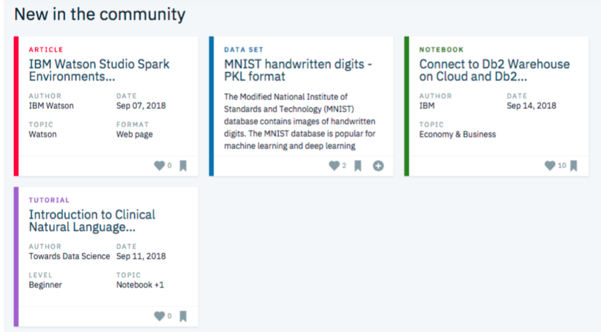

# Articles Recommender Engine in IBM Watson Platform

This project will analyze the interactions that users have with articles on the IBM Watson Studio platform, and make recommendations to them about new articles that they would most likely appreciate. Below is an example of what the dashboard could look like displaying articles on the IBM Watson Platform. 

Though the above dashboard is just showing the newest articles, the goal of this project is to have a recommendation board available here that shows the articles that are most pertinent to a specific user.

In order to determine which articles to show to each user, we will be performing a study of the data available on the IBM Watson Studio platform. This study focuses only on the articles part of the Watson's assets. 